# FlixMix

FlixMix is a comprehensive movie database created for passionate film enthusiasts. This user-friendly platform offers a seamless experience for users to explore and discover a vast collection of movies. Whether you're searching for a specific film or looking for inspiration, FlixMix has you covered. With intuitive search options such as title, cast, release, and directors, users can quickly find the movies they're interested in. The database provides detailed information on each film, including plot summaries, genres, and more, ensuring that users have access to comprehensive movie details.

One of the key features of FlixMix is the ability for users to actively engage with the platform. Users can share their thoughts and insights by writing reviews and assigning ratings to the movies they've watched, helping others make informed decisions. Additionally, users can curate personalized lists of movies, allowing them to create collections based on their preferences and share them with the community. By marking movies as seen or adding them to their watchlist, users can keep track of their movie-watching journey.

FlixMix fosters a sense of community and interaction among users. It enables users to comment on other users' lists and reviews, facilitating discussions and the exchange of opinions. Furthermore, users can follow other users and stay updated on their activity, promoting the discovery of new movies and the formation of connections with like-minded individuals.

Experience the captivating world of movies with FlixMix. Join today to explore an extensive movie database, engage with the community, and enhance your cinematic journey.

## UX


FlixMix boasts a sleek and modern design that enhances the user experience. The website adopts a light color palette, creating a clean and visually pleasing interface. Color accents are strategically used to highlight important elements, providing visual cues to guide users' attention. This ensures that key features and actions stand out when needed, making the navigation intuitive and user-friendly.

Given that FlixMix primarily revolves around lists of movies, comments, reviews, and user-created lists, the design utilizes a card-based layout. Each card presents essential information about the element, allowing users to preview basic details before delving into the dedicated page. This approach enables users to quickly assess the content and make informed decisions about what they want to explore further.

To enhance the dynamic nature of the website, FlixMix implements infinite scroll functionality. This feature allows users to seamlessly fetch additional content as they scroll vertically or horizontally, ensuring a fluid and continuous browsing experience. It eliminates the need for manual pagination and enables users to effortlessly access an extensive collection of movies and related information.

The design also incorporates informative tooltips and hover effects on various buttons. For instance, when users search for movies and apply filters, the buttons dynamically display relevant information, giving users visibility into the applied filters. This feature provides an interactive and informative element, helping users better understand the current context and their ongoing actions.

### Colour Scheme

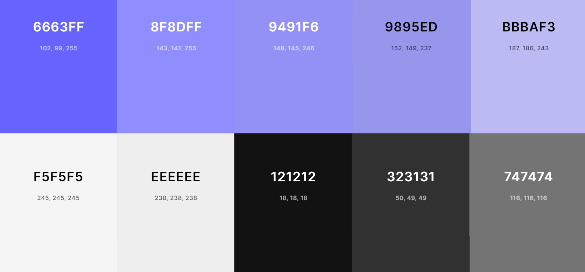

The color palette of the FlixMix website features a harmonious combination of shades to create an engaging and visually appealing experience. The background is set in a light gray tone, represented by rgb(238, 238, 238), which provides a clean and neutral foundation for the content.

For the majority of the cards, purple gradients are utilized as the background color as well as in the sidebar. These purple hues contribute to a consistent theme throughout the website, creating a cohesive and visually pleasing design.

To ensure optimal legibility, the text within the cards is typically presented in either white or a translucent white. When the background color of the card is predominantly white, the text is often displayed in rgb(116, 116, 116) or rgb(50, 49, 49), depending on the level of emphasis required. This contrast between the background and text colors helps to enhance readability and maintain a visually pleasing balance.

In cases where error alerts are displayed, shades of yellow are employed. These include rgb(148, 114, 49) and rgb(60, 46, 20). The use of these warm yellow tones helps to draw attention to important notifications or error messages, ensuring they stand out from the rest of the interface.

Additionally, certain icons that indicate active status are presented in white or rgb(145, 246, 148), which is a light green shade. These icons serve as visual indicators to inform users about the current state or functionality, contributing to a more intuitive and interactive user experience.

I've used CSS `:root` variables to easily update the global colour scheme by changing only one value, instead of everywhere in the CSS file.

```css
:root{
    --purple-1: rgb(102, 99, 255);
    --purple-2: rgb(143, 141, 255);
    --purple-3: rgb(148, 145, 246);
    --purple-4: rgb(152, 149, 237);
    --purple-5: rgb(187, 186, 243);
    --white-1: rgb(245, 245, 245);
    --white-2: rgb(238, 238, 238);
    --translucid-white: rgba(238, 238, 238, 0.8);
    --black: rgb(18,18,18);
    --grey-1: rgb(116,116,116);
    --grey-2:rgb(50, 49, 49);
    --gradient: 
        linear-gradient(to right bottom, rgba(141, 177, 255, 0.7), rgba(217, 141, 255, 0.29)),
        linear-gradient(to right top, rgba(255, 141, 255, 0.4), rgba(255, 141, 145, 0.1) 40%),
        linear-gradient(to right, var(--purple-3), var(--purple-3));
    --gradient-2: 
        linear-gradient(to bottom, var(--purple-3) 70px, rgba(148, 145, 246, 0) 150px),
        var(--gradient);
    --gradient-3: 
        radial-gradient(at bottom left , rgba(158, 255, 141, 0.2), rgba(141, 255, 236, 0.1) 50%, rgba(141, 255, 236, 0) 80%),
        linear-gradient(to right bottom, rgba(141, 177, 255, 0.7), rgba(217, 141, 255, 0.29)),
        radial-gradient(at top right , rgba(255, 141, 255, 0.4), rgba(255, 141, 145, 0.1) 40%),
        linear-gradient(to right, var(--purple-2), var(--purple-2));
    --gradient-4: 
        linear-gradient(to bottom, var(--purple-3) 25%, rgba(148, 145, 246, 0) ),
        radial-gradient(at bottom left , rgba(158, 255, 141, 0.2), rgba(141, 255, 236, 0.1) 50%, rgba(141, 255, 236, 0) 80%),
        linear-gradient(to right bottom, rgba(141, 177, 255, 0.7), rgba(217, 141, 255, 0.29)),
        radial-gradient(at top right , rgba(255, 141, 255, 0.4), rgba(255, 141, 145, 0.1) 40%),
        linear-gradient(to right, var(--purple-2), var(--purple-2));
}
```

### Typography

The site uses a mix of fonts to create a unique and modern look. These are provided by [Google Fonts](https://fonts.google.com/). The default font is [Open Sans](https://fonts.google.com/specimen/Open+Sans), which provides a clean and versatile base. [Poppins](https://fonts.google.com/specimen/Poppins) is mainly used in titles or links. The bold version (font weight of 700) pops in contrast with Open Sans, really emphasizing these texts. [Work Sans](https://fonts.google.com/specimen/Work+Sans) is used for the sidebar as well as for certain titles that are not as prominent as the main ones on a page and as the main font in the Custom Alert component. These font choices work together to create a cohesive and visually appealing design.
These deliberate font choices contribute to creating a visually appealing and consistent design.

[Font Awesome](https://fontawesome.com/) is also used to add different icons throughout the website

## User Stories

The user stories were broken down with 3 types of users in mind: "users" (non-registered users who can access the website), "Registered Users," and "Site Admins."

### Regular users (non registered)
- As a User I can always see a navbar so that I can navigate though the website
- As a User I can navigate without refreshing so that have a quicker and better experience
- As a User I can create an accound and log in so that access all the website features
- As a User I can see the movie information so that get the synopsis, title and basic information of the film
- As a User I can view all posts so that see all movies in the database
- As a User I can search a movie by title so that easily find the movie im looking for
- As a User I can filter the movies based on the cast, director, genre or release decade so that I can find movies based on specific parameters
- As a User I can keep scrolling when looking for a movie so that I dont need to use pagination to get more movies
- As a User I can see how many Registered users marked this movie as seen or added it to a watchlist so that i can tell how popular is the movie
- As a User I can read Reviews of other users so that I can hear other people opinions and how they rank a specific movie
- As a user, I can see lists created by other users so that I can discover new movie suggestions and see how other users have grouped movies
- As a user, I can search for a list by name so that I can quickly find a list that matches my interests.
- As a user, I can view other users' activity to see their new lists, reviews, and comments

### Registered Users
- As a Registed User I can see some indication that I am curretly logged in so that easily tell my logged status
- As a Registered User I can maintain my logged in status until i log out so that control this status myself
- As a Registed User I can have links to log in/log out according to my status so that I am not redirected no an unnecesary link
- As a Registered User I can view my avatar in the navbar so that easily identify my account
- As a Registered User I can add a movie to the database so that other users can see the movie information
- As a Registered User I can mark a movie as seen or add it to my future watchlistt so that keep a log of what movies i have and haven´t seen yet
- As a registered user, I can write a review of a movie to share my thoughts and impressions with others
- As a registered user, I can update a review I wrote so that i can correct it if I made a mistake or want to add more details
- As a registered user, I can delete a review I wrote if I change my mind about my opinion or want to remove it from the website
- As a registered user, I can comment on other users' movie reviews to share my thoughts and opinions
- As a registered user, I can create a list so that I can group movies according to a specific theme and share them with other users
- As a registered user, I can update a list I created so that I can correct mistakes or add new movies
- As a registered user, I can delete a list I created so that I can remove the list and its associated movies from the website
- As a registered user, I can comment on a list to share my opinion about the list's movie choices or theme
- As a registered user, I can follow another user to receive updates about their activity and new lists or reviews
- As a registered user, I can edit my comments to correct mistakes or add more information
- As a registered user, I can delete my comments so that if I change my mind about what I wrote or made a mistake, can remove it
- As a registered user, I can edit my username and password to update my account information or to increase my account security


### Site Admin
- As an Administrator of the site I can have a link to the admin panel so that easily access the admin functions
- As an Administrator of the site I can see a label that indicates this status so that easily differentiate that the logged account has special permissions
- As an admin, I can delete a movie from the database if there was a mistake or if the movie violates the website's rules
- As an admin, I can update movie information so that I can correct errors or adding missing details
- As an admin, I can access a specific panel to view users reports about movies and fix them

## Wireframes

To follow best practice, wireframes were developed for mobile, tablet, and desktop sizes.
I've used [Balsamiq](https://balsamiq.com/wireframes) to design my site wireframes.

### Index Wireframes
<details>
<summary>View Index Wireframes</summary>

| Size | Screenshot |
| --- | --- |
| Mobile | 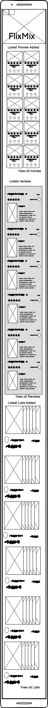 |
| Desktop | 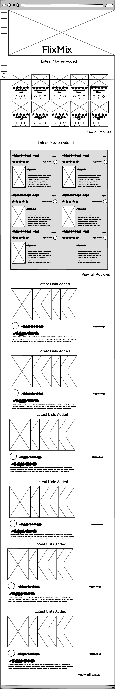 |

</details>

### Search Movies Wireframes
<details>
<summary>View Search Movies Wireframes</summary>

| Size | Screenshot |
| --- | --- |
| Mobile | 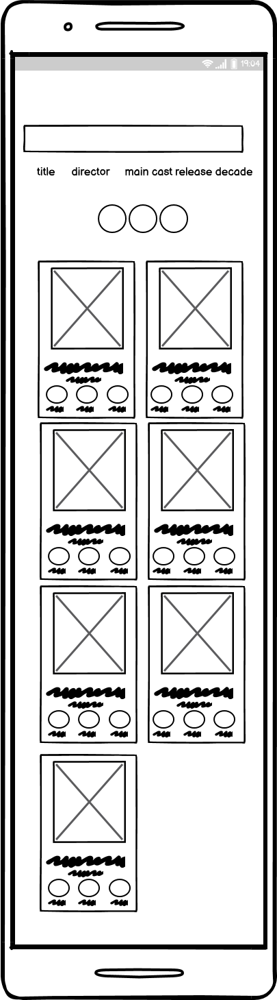 |
| Desktop | 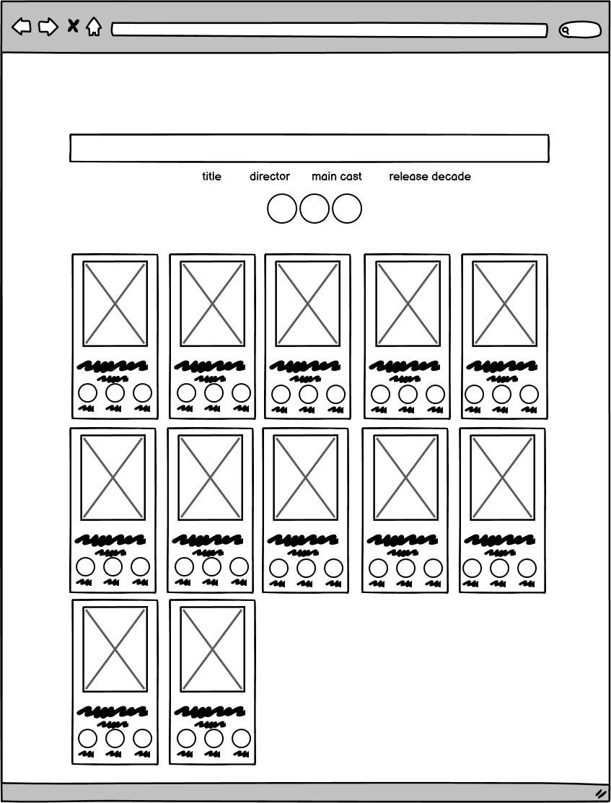 |
</details>

### Search Reviews Wireframes
<details>
<summary>View Search Reviews Wireframes</summary>

| Size | Screenshot |
| --- | --- |
| Mobile | 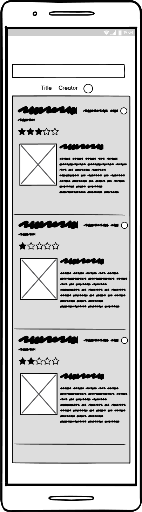 |
| Desktop | 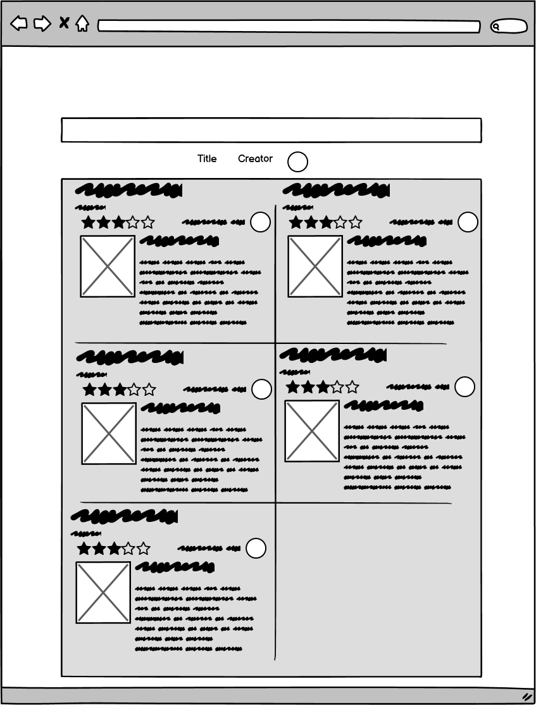 |
</details>

### Search Reviews Wireframes
<details>
<summary>View Search Reviews Wireframes</summary>

| Size | Screenshot |
| --- | --- |
| Mobile | 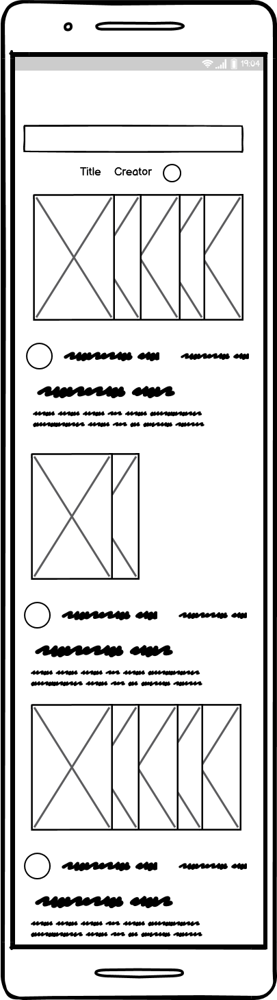 |
| Desktop | 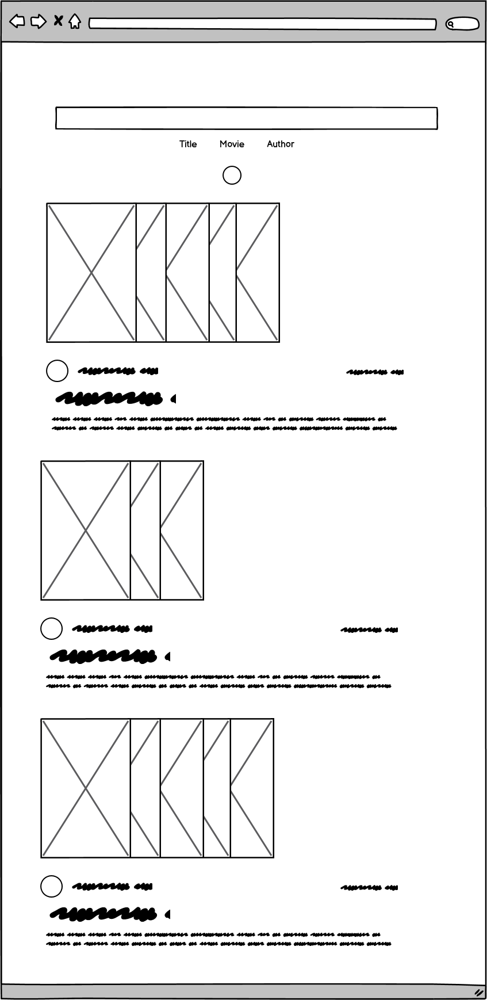 |
</details>

### Search Reviews Wireframes
<details>
<summary>View Search Reviews Wireframes</summary>

| Size | Screenshot |
| --- | --- |
| Mobile | 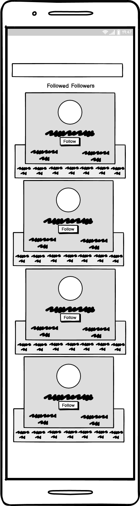 |
| Desktop | 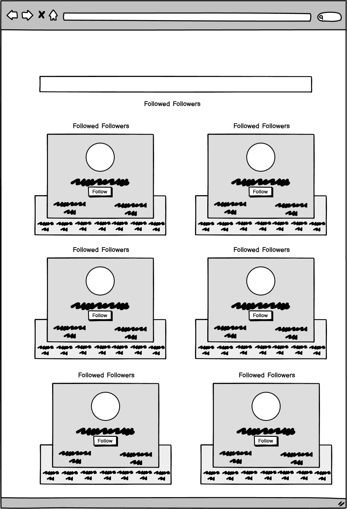 |
</details>

### Search Profiles Wireframes
<details>
<summary>View Search Profiles Wireframes</summary>

| Size | Screenshot |
| --- | --- |
| Mobile |  |
| Desktop |  |
</details>

### Create Edit Movie Wireframes
<details>
<summary>View Create Edit Movie Wireframes</summary>

| Size | Screenshot |
| --- | --- |
| Mobile | 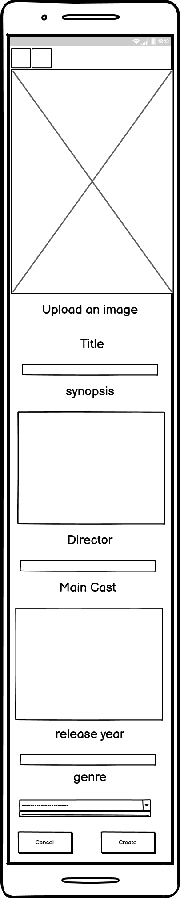 |
| Desktop | 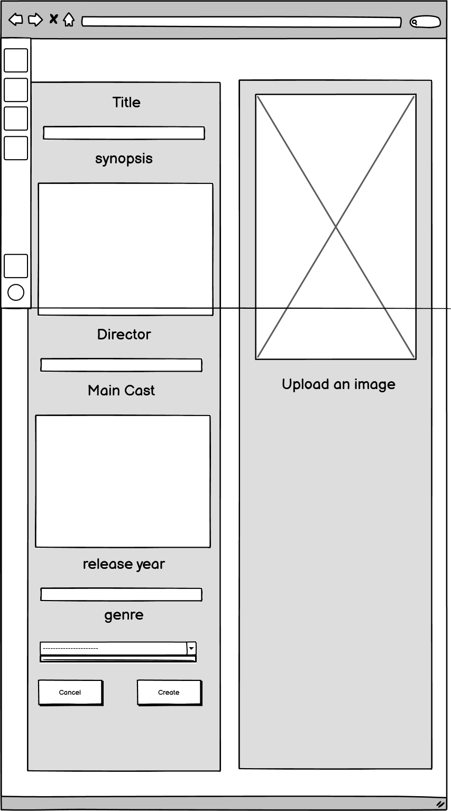 |
</details>

### Create List Wireframes
<details>
<summary>View Create List Wireframes</summary>

| Size | Screenshot |
| --- | --- |
| Mobile | 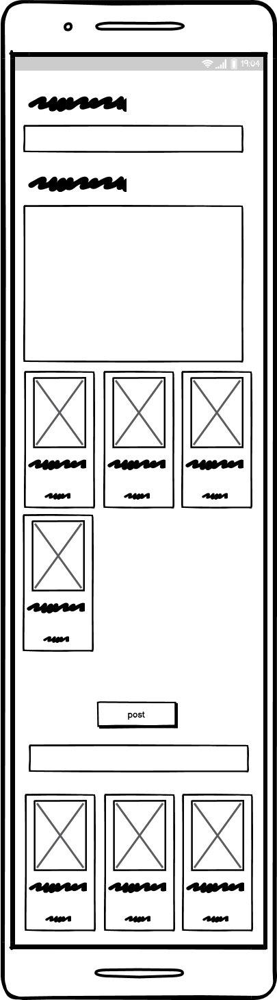 |
| Desktop | 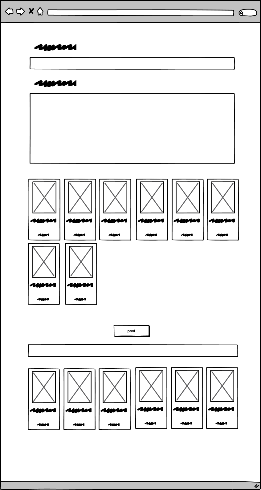 |
</details>

### Movie Details Wireframes
<details>
<summary>View Movie Details Wireframes</summary>

| Size | Screenshot |
| --- | --- |
| Mobile | 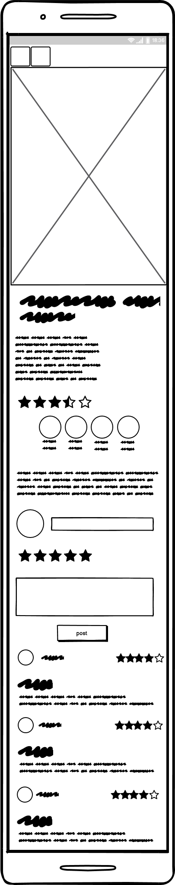 |
| Desktop | 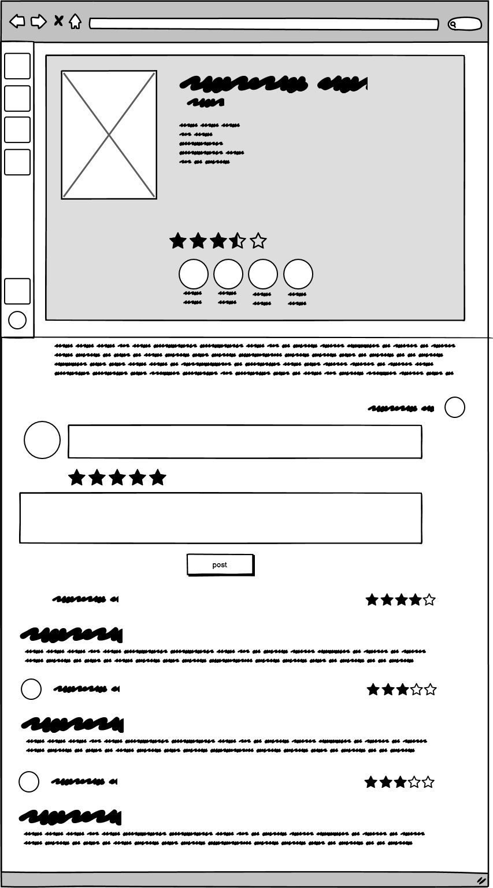 |
</details>

### Review Details Wireframes
<details>
<summary>View Review Details Wireframes</summary>

| Size | Screenshot |
| --- | --- |
| Mobile | 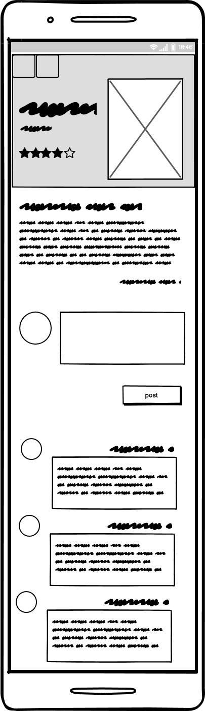 |
| Desktop | 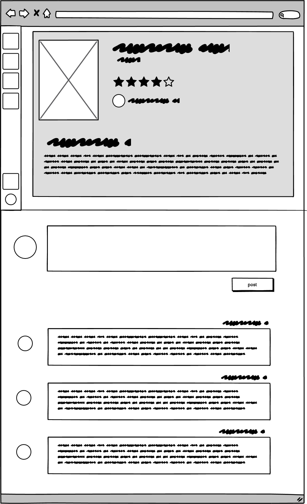 |
</details>

### List Details Wireframes
<details>
<summary>View List Details Wireframes</summary>

| Size | Screenshot |
| --- | --- |
| Mobile | 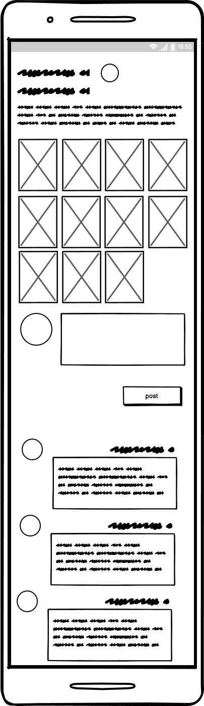 |
| Desktop | 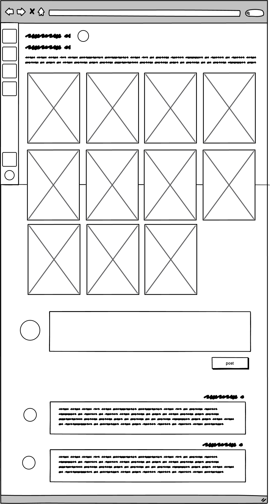 |
</details>

### Profile Page Wireframes
<details>
<summary>View Profile Page Wireframes</summary>

| Size | Screenshot |
| --- | --- |
| Mobile | 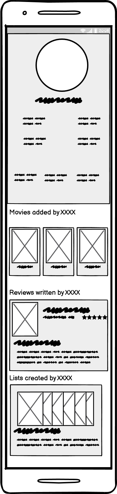 |
| Desktop | 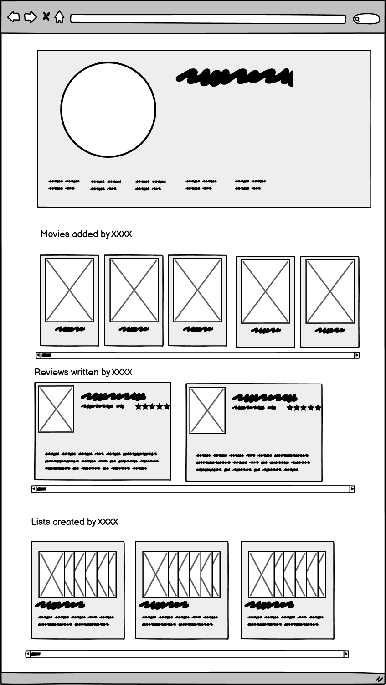 |
</details>

### Log Page Wireframes
<details>
<summary>View Log Page Wireframes</summary>

| Size | Screenshot |
| --- | --- |
| Mobile |  |
| Desktop | 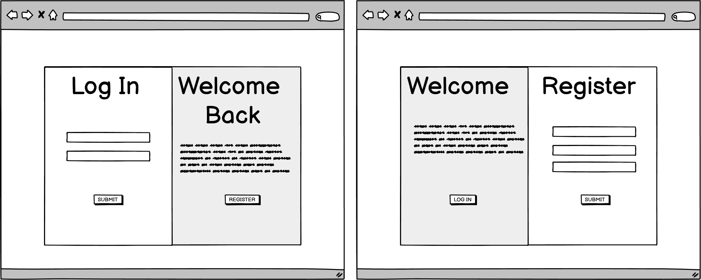 |
</details>


## Technologies Used

### Languages

- HTML
- CSS
- Javascript
  - React (16.18.0)

  ### Libraries, frameworks and dependencies

- [Axios:](https://axios-http.com/docs/intro) I use Axios in my code to fetch data from APIs, leveraging its simplicity and efficiency for handling HTTP requests and responses in React.
- [JWT](https://jwt.io/) I used the JWT library to decode JSON Web tokens in my application. By using JWT, I ensured that only authenticated users could access certain resources and prevented unauthorized users from making unnecessary network requests to refresh their access tokens. Additionally, I used JWT to handle scenarios where the token expired or the user logged out, ensuring a seamless and secure user experience by removing the token's timestamp from the browser.
- [React 16.18.0](https://17.reactjs.org/) I used the JavaScript library for building the interface
- [React-Bootstrap 4.6](https://legacy.reactjs.org/blog/2019/02/06/react-v16.8.0.html) I used the react bootstrap mainy to use the Form, Row, Col, Conteiner, Tooltip coponents as well as some Bootstrap classes for spacing.
- [React Infinite Scroll](https://www.npmjs.com/package/react-infinite-scroll-component) I used the library to automatically fetch more data as the user scrolls (movies, reviews, lists, profiles). I modify certain rules on css to be able to implement horizontal scroll as well as displaying in a grid system certain information.
- [React Router](https://v5.reactrouter.com/web/guides/quick-start) I used this library to nable navegation across different pages without the need to refresh the page.

### Tools & Programs

### Frameworks, Libraries & Programs Used
*   [Google Fonts](https://fonts.google.com/)
    * Used to import fonts.
*   [Font Awesome](https://fontawesome.com/)
    * Used to add all icons on the website.
*   [Balsamiq](https://balsamiq.com/)
    * Used to create the wireframes.
*   [Git](https://git-scm.com/)
    * Used to deploy through the Gitpod terminal.
*   [GitHub](https://github.com/)
    * Used the GitHub pages to deploy the website.
*   [Microsoft Paint](https://apps.microsoft.com/store/detail/paint/9PCFS5B6T72H?hl=en-us&gl=US)
    * Used to edit the screenshots provided in the README and TESTING files.
*   [Coolors](https://coolors.co/)
      * Used to display palettes used for README file.
*   [Am I Responsive?](https://ui.dev/amiresponsive)
      * Used to provide responsive screenshots used at the beggining of the README file.
*   [Cloudinary](https://cloudinary.com/)
      * Used to store static files.

## Features

### Pages

#### Home Page
- Beggins displaying an image and the website logo
- Uses the MoviesPreview component to show the latest movies added to the database
- Users are able here to mark any of this movies as seen or to add them to their watchlist
- Uses the RatingsPreview component to show the latest reviews added to the database
- Uses the ListsPreview component to show the latest lists added to the database

#### Search Movies
- The component fist has a search bar and a set of radio buttons and checkboxes. Clicking this alter states in the component and help to create a specific endpoint to look for a movie with very specific parameters
- Movies can be searched by movie title, director, cast or release decade and filtered by previously seen movies, movies in the watchlist or movies uploaded by followed users.
- The search bar can also be replaced by a dropdown option input to select a specific release decade.
- The page uses the MoviesPreview component to display all movies based on the search the user makes. if the user does not specify parameters all movies will be fetched.

#### Movie Page
- Displays information of a specific movie: title, release year, genre, synopsis, director, main cast, movie poster and average rating as well as how many people have seen, add this movie to the watchlist, reviewed them or how many times this movie appears on lists.
- A registered user can mark a movie as seen or add them to its watchlist.
- A registered user can report a movie if they find an error so the admin can fix it (using the ReportMovie component)
- A registered user can add a review of a movie.
- all the reviews of the movie are displayed here.

#### Movie Create Form
- In this form the user enters the movie information: title, release year, synopsis, director, main cast, genre and poster.
- If the form is not submited correctly the handleErrors helper function and the Alert component display the error.

#### Movie Edit Form
- In this form the admin can edit the movie information: title, release year, synopsis, director, main cast, genre and poster.
- The Component first fetches the movie information and displays it in the form.
- If the form is not submited correctly the handleErrors helper function and the Alert component display the error.

#### Search Reviews
- Originally named SearchRatingsPage to keep consistency with how the model was named on the API
- The component fist has a search bar and a set of radio buttons and a checkbox. Clicking this alter states in the component and help to create a specific endpoint to look for a review with very specific parameters.
- Reviews can  be searched by movie title and review author and filtered by profiles the user follows
- The page uses the RatingsPreview component to display all reviews based on the search the user makes. If the user does not specify parameters all reviews will be fetched.

#### Review Page
- Originally named RatingPage to keep consistency with how the model was named on the API
- Displays information of a specific Review: title, content, value, as well as the movie title, poster and release year.
- If the user is the owner of the review they can modify it here or delete it.
- A registered user can comment the review.
- All comments for this review are displayed here

#### Search Lists
- The component fist has a search bar and a set of radio buttons and checkboxes. Clicking this alter states in the component and help to create a specific endpoint to look for a list with very specific parameters
- Lists can be searched by list title, movie title or list author and filtered by profiles the user follows.
- The page uses the ListsPreview component to display all lists based on the search the user makes. If the user does not specify parameters all lists will be fetched.

#### List Page
- Displays information of a specific List: title, content as well as the movies posters.
- If the user is the owner of the review they can modify it or delete it.
- A registered user can comment the list.
- All comments for this lists are displayed here

#### List Create Form
- In this form the user enters the list information: title, and content.
- An input lets you search a movie by its title and display them here. clicking on one of this movies will diplay them in a previous container (encapsulating all selected movies)
- Clicking on one of the movies added to the selected movies container will remove them from the list.
- If the form is not submited correctly the handleErrors helper function and the Alert component display the error.

#### List Edit Form
- In this form the admin or the owner can edit the list information: title and content.
- The Component first fetches the list information and displays it in the form.
- the same search input and component displays all movies for the user to select them and de select them.
- If the form is not submited correctly the handleErrors helper function and the Alert component display the error.

#### Search Profiles
- The component fist has a search bar and a set of checkboxes. Clicking this alter states in the component and help to create a specific endpoint to look for a list with very specific parameters.
- Pofiles can be searched by username and filtered by profiles the user follows or that follow them.
- The page uses the ProfilesPreview component to display all profiles based on the search the user makes. If the user does not specify parameters all profiles will be fetched.
- A registed user will see a button thet allows them to follow or unfollow the user. This are rendered conditionally and will not appear on the same users profile card.

#### Profile Page
- Displays information of the profile: username, full name and bio as well as ammount of following profiles, followers, movies they have seen or added them to the watchlist, created movies, rated movies and lists created.
- A registed user will see a button thet allows them to follow or unfollow the user. This are rendered conditionally and will not appear on the same users profile card.
- All movies the user added, reviews the user wrote and lists the user created are displayed using infinite scroll and diaplyed horizontally.

#### Profile Edit (information) Form
- This page can only be accessed by that profile
- In this form the user edits its information: profile image, full name or bio.
- If the form is not submited correctly the handleErrors helper function and the Alert component display the error.

#### Profile Edit (username) Form
- This page can only be accessed by that profile
- In this form the user edits its username
- If the form is not submited correctly the handleErrors helper function and the Alert component display the error.

#### Profile Edit (password) Form
- This page can only be accessed by that profile
- In this form the user edits its password
- If the form is not submited correctly the handleErrors helper function and the Alert component display the error.

#### Search Reports Page
- This page can only be accessed by the admin.
- Here all movie reports are created, linking the movie and displaying the message the user made. 
- If the Admin fixed the issue or decides there is no issue to solve they can close it from here

#### Log Page
- This page can only be accessed by an unnergistered user.
- Here two forms are displayed
- A register form that allows to create a username or password.
- A Log in form that allows to access to the user using theirr credentials.
- If any form is not submited correctly the handleErrors helper function and the Alert component display the error.


