# Testing

## Validation

### HTML Validation

### CSS Validation

Result from [W3C CSS Validation Service](https://jigsaw.w3.org/css-validator) for style.css. The code was validated by copying and pasting the code directly to the validator:

#### App.module.css

View Validation

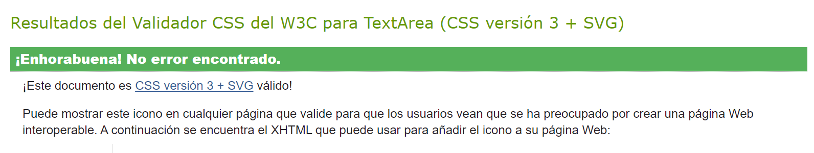

#### Alert.module.css

View Validation

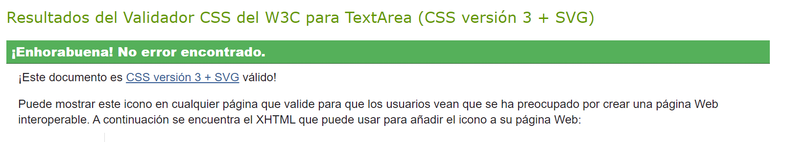

#### Asset.module.css

View Validation

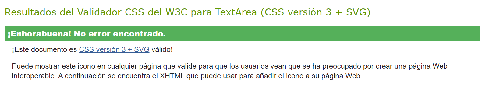

#### Avatar.module.css

View Validation

#### Button.module.css

View Validation

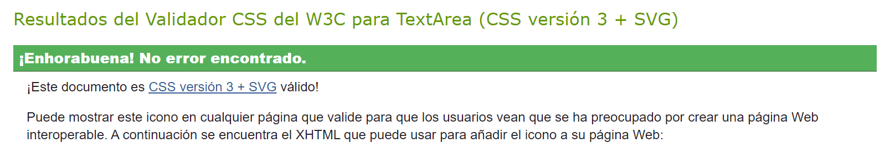

#### Comment.module.css

View Validation

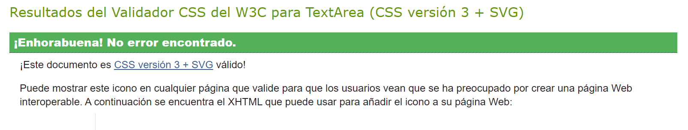

#### CommentCreateEditForm.module.css

View Validation

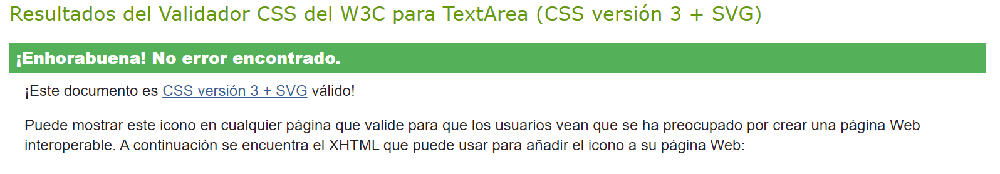

#### DisplayRating.module.css

View Validation

#### errorPage.module.css

View Validation

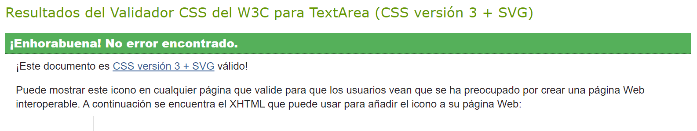

#### FullScreenModal.module.css

View Validation

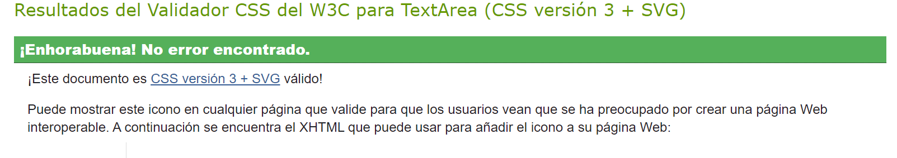

#### Home.module.css

View Validation

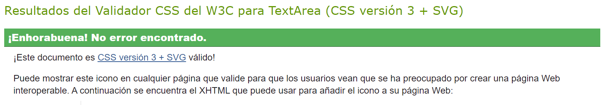

#### ListDisplayMovies.module.css

View Validation

#### ListPage.module.css

View Validation

#### ListPreviewCard.module.css

View Validation

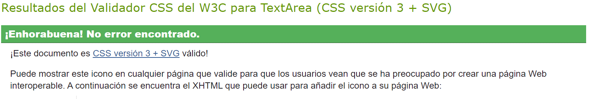

#### ListsPreview.module.css

View Validation

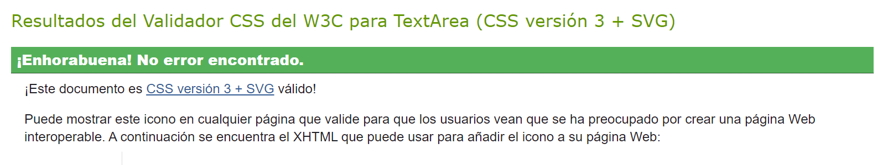

#### LogInRegister.module.css

View Validation

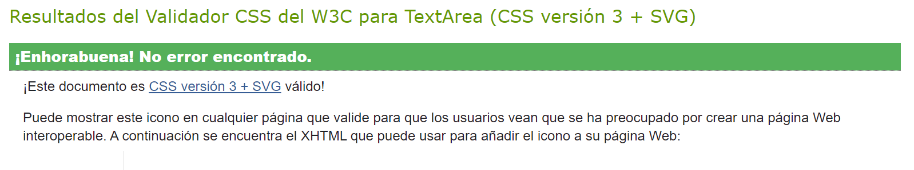

#### MoreDropdown.module.css

View Validation

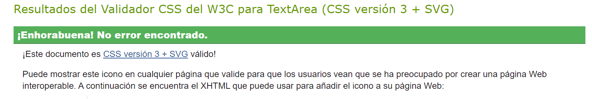

#### Movie.module.css

View Validation

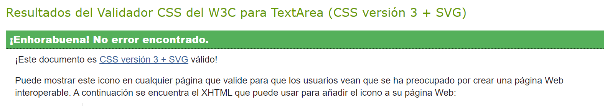

#### MovieCreateEditForm.module.css

View Validation

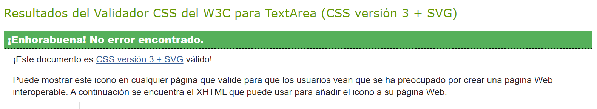

#### MoviePage.module.css

View Validation

#### MoviePreviewCard.module.css

View Validation

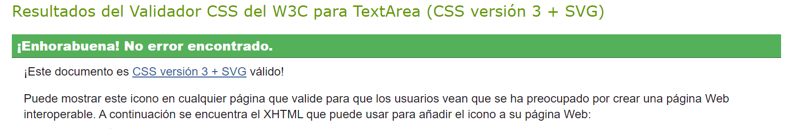

#### MoviesPreview.module.css

View Validation

#### ProfileContentDisplay.module.css

View Validation

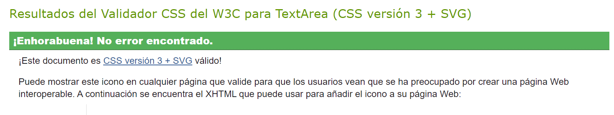

#### ProfileListPreviewCard.module.css

View Validation

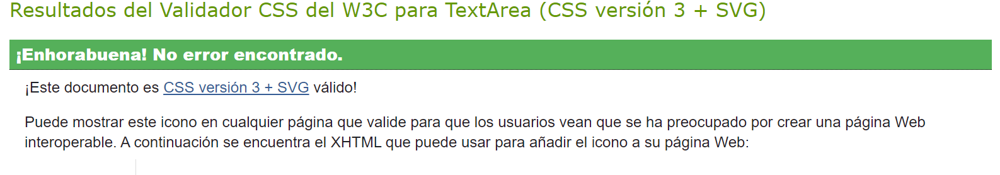

#### ProfileMoviePreviewCard.module.css

View Validation

#### ProfilePage.module.css

View Validation

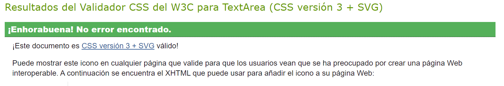

#### ProfilePreviewCard.module.css

View Validation

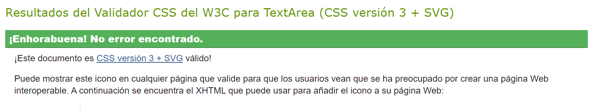

#### ProfileRatingPreviewCard.module.css

View Validation

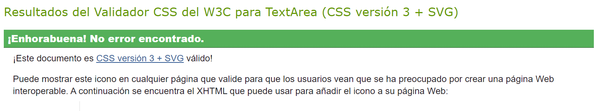

#### ProfilesPreview.module.css

View Validation

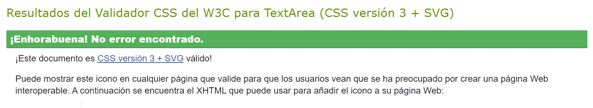

#### RateButtons.module.css

View Validation

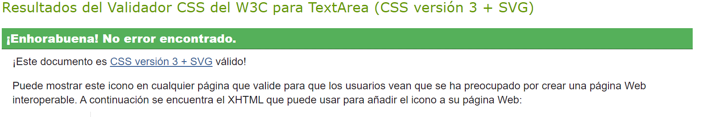

#### RatingCreateEditForm.module.css

View Validation

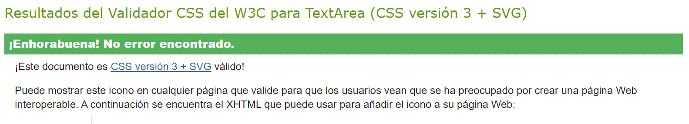

#### RatingMoviePage.module.css

View Validation

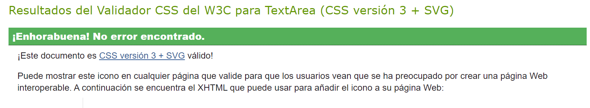

#### RatingPage.module.css

View Validation

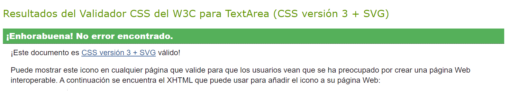

#### RatingPreviewCard.module.css

View Validation

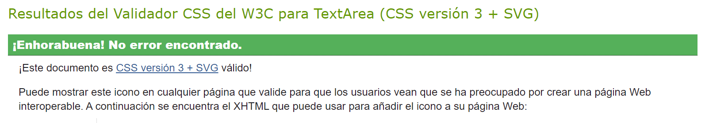

#### RatingsPreview.module.css

View Validation

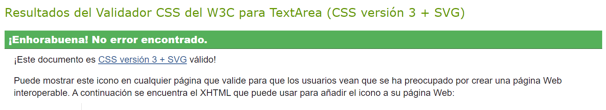

#### ReportCard.module.css

View Validation

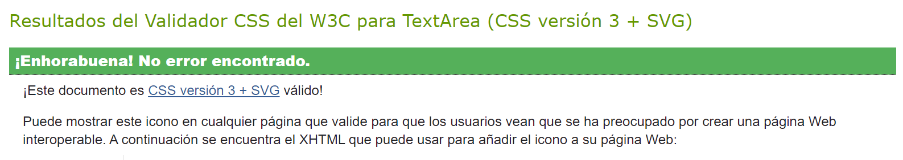

#### ReportMovie.module.css

View Validation

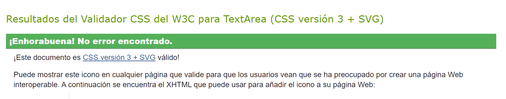

#### ReportsPreview.module.css

View Validation

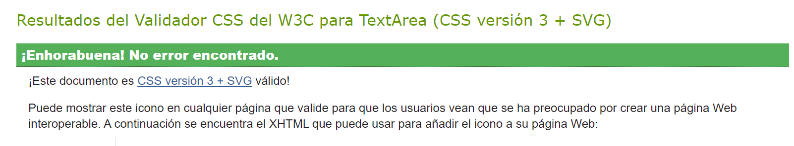

#### SearchPage.module.css

View Validation

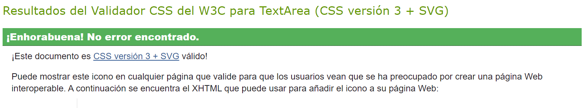

#### Sidebar.module.css

View Validation

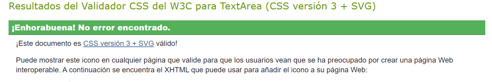

### JSX Validation
The JSX conde was validated using [Eslint](https://eslint.org/). During my first run I encountered 2 errors that do not affect the functionality:
- missing in props in validation.
- and Do not pass children as props. Instead, nest children between the opening and closing tags (In my infiniteScroll components)

Due to this not really affecting the functionalities of the website were ignored and the Eslint setting where ovvertten to ignore this issues.

View Report

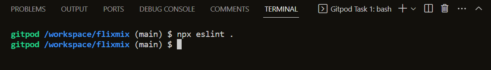

## Lighthouse Audit

## Resosiveness

## Browser Compatibility

## Testing

### User Story Testing

### Unit Testing

## Bugs

### Unsolved Bugs