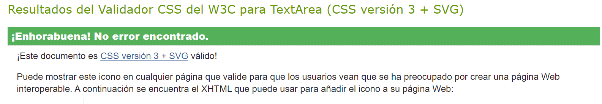

# Testing

## Validation

### HTML Validation

I have used the recommended [HTML W3C Validator](https://validator.w3.org) to validate all of my HTML files.

| Page |  Screenshot |
| --- | --- |
| Index |  |
| Search Movies |  |
| Search Reviews |  |
| Search Lists |  |
| Search Profiles |  |
| Movie Page |  |
| Movie Create |  |
| Movie Edit |  |
| Review Page |  |
| List Page |  |
| List Create |  |
| List Edit |  |
| Profile Page |  |
| Profile Edit |  |
| Profile Edit(Username) |  |
| Profile Edit(Password) |  |
| Admin Panel |  |
| Log In Form |  |
| Error page |  |

### CSS Validation

Result from [W3C CSS Validation Service](https://jigsaw.w3.org/css-validator) for style.css. The code was validated by copying and pasting the code directly to the validator:

#### App.module.css

View Validation

#### Alert.module.css

View Validation

#### Asset.module.css

View Validation

#### Avatar.module.css

View Validation

#### Button.module.css

View Validation

#### Comment.module.css

View Validation

#### CommentCreateEditForm.module.css

View Validation

#### DisplayRating.module.css

View Validation

#### errorPage.module.css

View Validation

#### FullScreenModal.module.css

View Validation

#### Home.module.css

View Validation

#### ListDisplayMovies.module.css

View Validation

#### ListPage.module.css

View Validation

#### ListPreviewCard.module.css

View Validation

#### ListsPreview.module.css

View Validation

#### LogInRegister.module.css

View Validation

#### MoreDropdown.module.css

View Validation

#### Movie.module.css

View Validation

#### MovieCreateEditForm.module.css

View Validation

#### MoviePage.module.css

View Validation

#### MoviePreviewCard.module.css

View Validation

#### MoviesPreview.module.css

View Validation

#### ProfileContentDisplay.module.css

View Validation

#### ProfileListPreviewCard.module.css

View Validation

#### ProfileMoviePreviewCard.module.css

View Validation

#### ProfilePage.module.css

View Validation

#### ProfilePreviewCard.module.css

View Validation

#### ProfileRatingPreviewCard.module.css

View Validation

#### ProfilesPreview.module.css

View Validation

#### RateButtons.module.css

View Validation

#### RatingCreateEditForm.module.css

View Validation

#### RatingMoviePage.module.css

View Validation

#### RatingPage.module.css

View Validation

#### RatingPreviewCard.module.css

View Validation

#### RatingsPreview.module.css

View Validation

#### ReportCard.module.css

View Validation

#### ReportMovie.module.css

View Validation

#### ReportsPreview.module.css

View Validation

#### SearchPage.module.css

View Validation

#### Sidebar.module.css

View Validation

### JSX Validation
The JSX conde was validated using [Eslint](https://eslint.org/). During my first run I encountered 2 errors that do not affect the functionality:
- missing in props in validation.
- and Do not pass children as props. Instead, nest children between the opening and closing tags (In my infiniteScroll components)

Due to this not really affecting the functionalities of the website were ignored and the Eslint setting where ovvertten to ignore this issues.

View Report

## Lighthouse Audit
All the pages that do not rquire validation were validated using LIghthouse Audit. This is because thoise that require validation on lighthouse audit are not able to be accessed and analized.
The performance scroce was lowered because of the size of the images. But that is due that the user can enter a image for a movie and in some pages they are displayed in a small format and the Lighthouse audit does not find this as good practices.

| Page Audited |  Screenshot |
| --- | --- |
| Index |  |
| Log In Form |  |
| Movie Page |  |
| Search Movies |  |
| Review Page |  |
| Search Reviews |  |
| List Page |  |
| Search Lists |  |
| Profile Page |  |
| Search Profiles |  |

## Responsiveness

## Browser Compatibility

## Testing

### User Story Testing

### React Testing
2 of the most common components in my application were tested to check conditional rendering. This were Sidebar and Avatar components.
Here is the result:

View Testing

## Bugs

### Unsolved Bugs