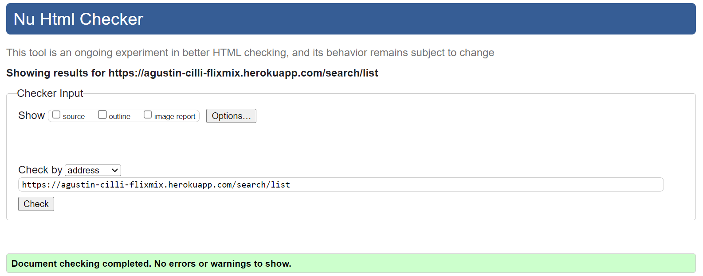
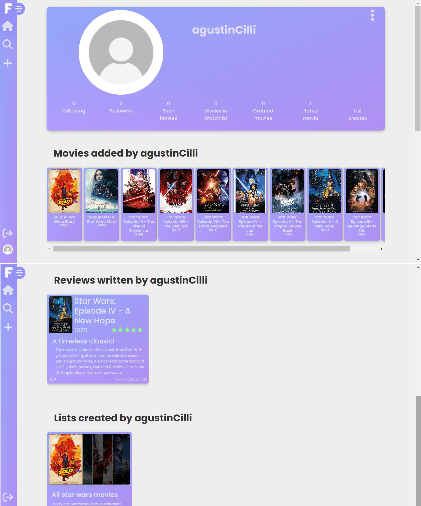

# Testing

## Validation

### HTML Validation

I have used the recommended [HTML W3C Validator](https://validator.w3.org) to validate all of my HTML files.

| Page |  Screenshot |
| --- | --- |
| Index |  |
| Search Movies |  |
| Search Reviews |  |
| Search Lists |  |
| Search Profiles |  |
| Movie Page |  |
| Movie Create |  |
| Movie Edit |  |
| Review Page |  |
| List Page |  |
| List Create |  |
| List Edit |  |
| Profile Page |  |
| Profile Edit |  |
| Profile Edit(Username) |  |
| Profile Edit(Password) |  |
| Admin Panel |  |
| Log In Form |  |
| Error page |  |

### CSS Validation

Result from [W3C CSS Validation Service](https://jigsaw.w3.org/css-validator) for style.css. The code was validated by copying and pasting the code directly to the validator:

#### App.module.css

View Validation

#### Alert.module.css

View Validation

#### Asset.module.css

View Validation

#### Avatar.module.css

View Validation

#### Button.module.css

View Validation

#### Comment.module.css

View Validation

#### CommentCreateEditForm.module.css

View Validation

#### DisplayRating.module.css

View Validation

#### errorPage.module.css

View Validation

#### FullScreenModal.module.css

View Validation

#### Home.module.css

View Validation

#### ListDisplayMovies.module.css

View Validation

#### ListPage.module.css

View Validation

#### ListPreviewCard.module.css

View Validation

#### ListsPreview.module.css

View Validation

#### LogInRegister.module.css

View Validation

#### MoreDropdown.module.css

View Validation

#### Movie.module.css

View Validation

#### MovieCreateEditForm.module.css

View Validation

#### MoviePage.module.css

View Validation

#### MoviePreviewCard.module.css

View Validation

#### MoviesPreview.module.css

View Validation

#### ProfileContentDisplay.module.css

View Validation

#### ProfileListPreviewCard.module.css

View Validation

#### ProfileMoviePreviewCard.module.css

View Validation

#### ProfilePage.module.css

View Validation

#### ProfilePreviewCard.module.css

View Validation

#### ProfileRatingPreviewCard.module.css

View Validation

#### ProfilesPreview.module.css

View Validation

#### RateButtons.module.css

View Validation

#### RatingCreateEditForm.module.css

View Validation

#### RatingMoviePage.module.css

View Validation

#### RatingPage.module.css

View Validation

#### RatingPreviewCard.module.css

View Validation

#### RatingsPreview.module.css

View Validation

#### ReportCard.module.css

View Validation

#### ReportMovie.module.css

View Validation

#### ReportsPreview.module.css

View Validation

#### SearchPage.module.css

View Validation

#### Sidebar.module.css

View Validation

### JSX Validation
The JSX conde was validated using [Eslint](https://eslint.org/). During my first run I encountered 2 errors that do not affect the functionality:
- missing in props in validation.
- and Do not pass children as props. Instead, nest children between the opening and closing tags (In my infiniteScroll components)

Due to this not really affecting the functionalities of the website were ignored and the Eslint setting where ovvertten to ignore this issues.

View Report

## Lighthouse Audit
All the pages that do not rquire validation were validated using LIghthouse Audit. This is because thoise that require validation on lighthouse audit are not able to be accessed and analized.
The performance scroce was lowered because of the size of the images. But that is due that the user can enter a image for a movie and in some pages they are displayed in a small format and the Lighthouse audit does not find this as good practices.

| Page Audited |  Screenshot |
| --- | --- |
| Index |  |
| Log In Form |  |
| Movie Page |  |
| Search Movies |  |
| Review Page |  |
| Search Reviews |  |
| List Page |  |
| Search Lists |  |
| Profile Page |  |
| Search Profiles |  |

## Responsiveness
Here are comparissions of some of the different pages displayed in desktop mode and on mobile (this mas made using the chrome dev tools and setting the screen to a size of an Iphone SE)

### Home Page

View Home Page

| Mobile |  Desktop |
| --- | --- |
|  |  |

### Search Movie

View Search Movie

| Mobile |  Desktop |
| --- | --- |
|  |  |

### Movie Page

View Movie Page

| Mobile |  Desktop |
| --- | --- |
|  |  |

### Movie Create

View Movie Create

| Mobile |  Desktop |
| --- | --- |
|  |  |

### List Page

View List Page

| Mobile |  Desktop |
| --- | --- |
|  |  |

### List Create

View List Create

| Mobile |  Desktop |
| --- | --- |
|  |  |

### Profile Page

View Profile Page

| Mobile |  Desktop |
| --- | --- |
|  |  |

### Log Page

View Log Page

| Mobile |  Desktop |
| --- | --- |
|  |  |

## Browser Compatibility

All previous screenshots for the responsiveness section were made with google chrome. here are some screenshots taken with [Mozilla Firefox](https://www.mozilla.org/en-US/firefox/) and [Microsoft Edge](https://www.microsoft.com/en-us/edge?form=MA13FJ&exp=e00)

### Mozilla Firefox

| Page |  Screenshot |
| --- | --- |
| Review Page |  |
| Edit List |  |
| Edit Movie |  |
| Admin Panel |  |

### Microsoft Edge

| Page |  Screenshot |
| --- | --- |
| Log Page |  |
| Full Screen Modal |  |
| Movie Page |  |
| list Page |  |

## Testing

### User Story Testing

- As a User I can always see a navbar so that I can navigate though the website

| Step | Expected Result | Actual Result |
| ---------- | ---------- | ---------- |
| Load any page of the website| Navbar is in fixed position at the left corner of the page | Works as expected |

- As a User I can navigate without refreshing so that have a quicker and better experience

| Step | Expected Result | Actual Result |
| ---------- | ---------- | ---------- |
| Click on any link in the Navbar | Using react router the user moves without refreshing the website | Works as expected |

- As a User I can create an accound and log in so that access all the website features

| Step | Expected Result | Actual Result |
| ---------- | ---------- | ---------- |
| Click on the Log in / Register link and fill the registration form and the sign in | The website will create an account for the user and then they will be able to access it with their credentials | Works as expected |

- As a User I can see the movie information so that get the synopsis, title and basic information of the film

| Step | Expected Result | Actual Result |
| ---------- | ---------- | ---------- |
| Search for a movie and access it though its link | The movie page will appear and show all the movie information | Works as expected |

- As a User I can view all posts so that see all movies in the database

| Step | Expected Result | Actual Result |
| ---------- | ---------- | ---------- |
| Go to the Search movie page | All movies in the database will be displayed in that page | Works as expected |

- As a User I can search a movie by title so that easily find the movie im looking for

| Step | Expected Result | Actual Result |
| ---------- | ---------- | ---------- |
| Go to the Search movie page | Using the searchBar the user to track a movie easily | Works as expected |

- As a User I can filter the movies based on the cast, director, genre or release decade so that I can find movies based on specific parameters

| Step | Expected Result | Actual Result |
| ---------- | ---------- | ---------- |
| Go to the Search movie page | Using the filter option will allow the user to filter movies easily | Works as expected |

- As a User I can keep scrolling when looking for a movie so that I dont need to use pagination to get more movies

| Step | Expected Result | Actual Result |
| ---------- | ---------- | ---------- |
| Go to the Search movie page | React infinite scroll allows the user to keep scrolling to fetch data | Works as expected |

- As a User I can see how many Registered users marked this movie as seen or added it to a watchlist so that i can tell how popular is the movie

| Step | Expected Result | Actual Result |
| ---------- | ---------- | ---------- |
| Go to the movie page | Between the movie information will also appear how many users have seen the movie | Works as expected |

- As a User I can read Reviews of other users so that I can hear other people opinions and how they rank a specific movie

| Step | Expected Result | Actual Result |
| ---------- | ---------- | ---------- |
| Go to the movie page | Bellow the movie information will also appear the list of all reviews (including rating) of the movie | Works as expected |

- As a user, I can see lists created by other users so that I can discover new movie suggestions and see how other users have grouped movies

| Step | Expected Result | Actual Result |
| ---------- | ---------- | ---------- |
| Go to the Search list page | All lists will be displayed here | Works as expected |

- As a user, I can search for a list by name so that I can quickly find a list that matches my interests.

| Step | Expected Result | Actual Result |
| ---------- | ---------- | ---------- |
| Go to the Search list page | Using the filters the user can search a list by its title or a movie title in it | Works as expected |

- As a user, I can view other users' activity to see their new lists, reviews, and comments

| Step | Expected Result | Actual Result |
| ---------- | ---------- | ---------- |
| Go to a user´s profile page | Here all lists, reviews, movies added will appear as well as the count of movies the user has seen or wants to see | Works as expected |

- As a Registed User I can see some indication that I am curretly logged in so that easily tell my logged status

| Step | Expected Result | Actual Result |
| ---------- | ---------- | ---------- |
| Go to any page | The navbar will display the users avatar and their username | Works as expected |

- As a Registered User I can maintain my logged in status until i log out so that control this status myself

| Step | Expected Result | Actual Result |
| ---------- | ---------- | ---------- |
| Log in to the application and do not log out within the 24 hours | Users stay logged in for 24 hours unless choosing to log out themselves | Works as expected |

- As a Registed User I can have links to log in/log out according to my status so that I am not redirected no an unnecesary link

| Step | Expected Result | Actual Result |
| ---------- | ---------- | ---------- |
| Go to any page | The Navbar will conditionally render links for log in/out according to the user status | Works as expected |

- As a Registered User I can view my avatar in the navbar so that easily identify my account

| Step | Expected Result | Actual Result |
| ---------- | ---------- | ---------- |
| Go to any page | The navbar will display the users avatar | Works as expected |

- As a Registered User I can add a movie to the database so that other users can see the movie information

| Step | Expected Result | Actual Result |
| ---------- | ---------- | ---------- |
| Go to the Add movie page | The user can crete a movie by correcly filling the form | Works as expected |

- As a Registered User I can mark a movie as seen or add it to my future watchlist so that keep a log of what movies i have and haven´t seen yet

| Step | Expected Result | Actual Result |
| ---------- | ---------- | ---------- |
| Go to the home page, search movie page or the movie Page | The seen and watchlist icon are buttons that will allow the user to mark a movie as seen or add it to their watchlist | Works as expected |

- As a registered user, I can write a review of a movie to share my thoughts and impressions with others

| Step | Expected Result | Actual Result |
| ---------- | ---------- | ---------- |
| Go to the Movie Page and write a review | by corrcly filling the value title and content of the review the user can share their opinion of the movie | Works as expected |

- As a registered user, I can update a review I wrote so that i can correct it if I made a mistake or want to add more details

| Step | Expected Result | Actual Result |
| ---------- | ---------- | ---------- |
| Go to the movie page or review page | If the user is the owner a button will appear allowing them to edit the review | Works as expected |

- As a registered user, I can delete a review I wrote if I change my mind about my opinion or want to remove it from the website

| Step | Expected Result | Actual Result |
| ---------- | ---------- | ---------- |
| Go to the movie page or review page | If the user is the owner a button will appear allowing them to delete the review | Works as expected |

- As a registered user, I can comment on other users' movie reviews to share my thoughts and opinions

| Step | Expected Result | Actual Result |
| ---------- | ---------- | ---------- |
| Go to a review page | Registered users will find at the bottom a box that will allow them to write a comment | Works as expected |

- As a registered user, I can create a list so that I can group movies according to a specific theme and share them with other users

| Step | Expected Result | Actual Result |
| ---------- | ---------- | ---------- |
| Go to the Add list page | Registered users can create a list selecting any movie in their database | Works as expected |

- As a registered user, I can update a list I created so that I can correct mistakes or add new movies

| Step | Expected Result | Actual Result |
| ---------- | ---------- | ---------- |
| Go to the list page | If the user is the owner a button will appear allowing them to update the list | Works as expected |

- As a registered user, I can delete a list I created so that I can remove the list and its associated movies from the website

| Step | Expected Result | Actual Result |
| ---------- | ---------- | ---------- |
| Go to the list page | If the user is the owner a button will appear allowing them to delete the list || Works as expected |

- As a registered user, I can comment on a list to share my opinion about the list's movie choices or theme

| Step | Expected Result | Actual Result |
| ---------- | ---------- | ---------- |
| Go to a list page | Registered users will find at the bottom a box that will allow them to write a comment | Works as expected |

- As a registered user, I can follow another user to receive updates about their activity and new lists or reviews

| Step | Expected Result | Actual Result |
| ---------- | ---------- | ---------- |
| Go to a profile mPage or search profile Pages | A button will conditionally render allowing user to follow unfollow other users | Works as expected |

- As a registered user, I can edit my comments to correct mistakes or add more information

| Step | Expected Result | Actual Result |
| ---------- | ---------- | ---------- |
| Go to a list or review page | If the user is the owner of the comment a button will appear allowing them to update their comment | Works as expected |

- As a registered user, I can delete my comments so that if I change my mind about what I wrote or made a mistake, can remove it

| Step | Expected Result | Actual Result |
| ---------- | ---------- | ---------- |
| Go to a list or review page | If the user is the owner of the comment a button will appear allowing them to delete their comment | Works as expected |

- As a registered user, I can edit my username and password to update my account information or to increase my account security

| Step | Expected Result | Actual Result |
| ---------- | ---------- | ---------- |
| Go to your profile Page | A button will conditionally render linking to the edit profile forms. Filling this will let them update their username or password | Works as expected |

- As an Administrator of the site I can have a link to the admin panel so that easily access the admin functions

| Step | Expected Result | Actual Result |
| ---------- | ---------- | ---------- |
| Go to any page | The Navbar will render for the admin a link to the admin panel | Works as expected |

- As an Administrator of the site I can see a label that indicates this status so that easily differentiate that the logged account has special permissions

| Step | Expected Result | Actual Result |
| ---------- | ---------- | ---------- |
| Go to any page | The Navbar will render for the admin under their username a text that shows their admin status | Works as expected |

- As an admin, I can delete a movie from the database if there was a mistake or if the movie violates the website's rules

| Step | Expected Result | Actual Result |
| ---------- | ---------- | ---------- |
| Go to a movie Page | The admin will find a button that allows them to delete the movie  | Works as expected |

- As an admin, I can update movie information so that I can correct errors or adding missing details

| Step | Expected Result | Actual Result |
| ---------- | ---------- | ---------- |
| Go to a movie Page | The admin will find a button that allows them to update the movie  | Works as expected |

- As an admin, I can access a specific panel to view users reports about movies and fix them

| Step | Expected Result | Actual Result |
| ---------- | ---------- | ---------- |
| Click the admin panel link in the navbar | Here all reports made by the users will be located  | Works as expected | 

### React Testing
2 of the most common components in my application were tested to check conditional rendering. This were Sidebar and Avatar components.
Here is the result:

View Testing

## Bugs

### Unsolved Bugs